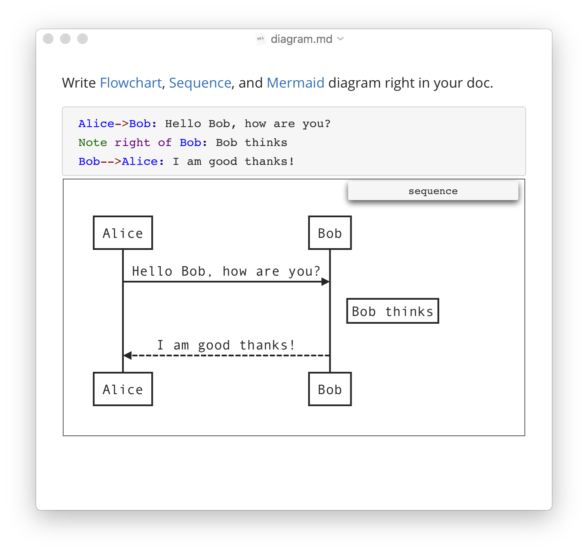
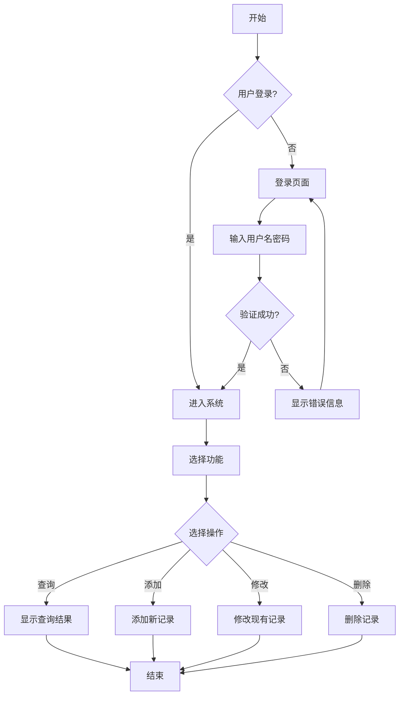
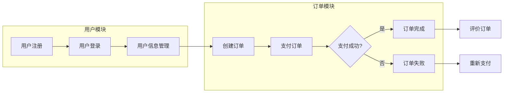

# Markdown渲染引擎测试文档

## 一、数学公式

**行内公式：** $E=mc^2$ 和 $\alpha + \beta = \gamma$

**块级公式：**
$$
\begin{align}
\text{Fermi: } \Xi_l &=\sum_{a_l=0}^1e^{-(\alpha+\beta \varepsilon_l)a_l}=1+e^{-(\alpha+\beta \varepsilon_l)} \quad \overline{a_l}=\frac{1}{e^{\alpha+\beta \varepsilon_l}+1}
\\
\text{Bose: } \Xi_l &=\sum_{a_l=0}^{\infty}e^{-(\alpha+\beta \varepsilon_l)a_l}=\frac{1}{1-e^{-(\alpha+\beta \varepsilon_l)}} \quad \overline{a_l}=\frac{1}{e^{\alpha+\beta \varepsilon_l}-1}
\end{align}
$$

$$
\begin{aligned}
\Xi &= \prod_m\sum_{a_m}e^{-(\alpha+\beta \varepsilon_m)a_m} = \prod_m \Xi_m
\\
a_1,& a_2, \cdots,a_l,\cdots a_m \text{ are all variables and } a_l \text{ is one of them.}
\\
\overline{a_l}&=\frac{1}{\Xi}\left(\sum_{a_l}a_le^{-(\alpha+\beta\varepsilon_l)a_l}\right)\cdot\prod_{m\neq l}\left(\sum_{a_m}e^{-(\alpha+\beta\varepsilon_m)a_m}\right)
\\
&=\frac{1}{\Xi_l}\sum_{a_l}a_le^{-(\alpha+\beta\varepsilon_l)a_l}
\\
&=-\frac{\partial \ln\Xi_l}{\partial \alpha}
\end{aligned}
$$

矩阵
$$
e^{-\frac{it}{\hbar}H}=\cos(\frac{E}{\hbar}t)
\begin{pmatrix}
1 & 0 \\
0 & 1 \\
\end{pmatrix}
+\sin(\frac{E}{\hbar}t)
\begin{pmatrix}
0 & -1 \\
1 & 0 \\
\end{pmatrix}
=
\begin{pmatrix}
\cos(\frac{E}{\hbar}t) & -\sin(\frac{E}{\hbar}t) \\
\sin(\frac{E}{\hbar}t) & \cos(\frac{E}{\hbar}t) \\
\end{pmatrix}
$$
多行公式
$$
\begin{align}
a &= b + c \\
d &= e \times f \\
g &= \frac{h}{i}
\end{align}
$$

## 二、代码块

**Python代码：**

```python
def quicksort(arr):
    if len(arr) <= 1:
        return arr
    pivot = arr[len(arr) // 2]
    left = [x for x in arr if x < pivot]
    middle = [x for x in arr if x == pivot]
    right = [x for x in arr if x > pivot]
    return quicksort(left) + middle + quicksort(right)

print(quicksort([3,6,8,10,1,2,1]))
```

**JavaScript代码：**

```javascript
class Person {
    constructor(name, age) {
        this.name = name;
        this.age = age;
    }
    
    greet() {
        return `Hello, my name is ${this.name} and I am ${this.age} years old.`;
    }
}

const person = new Person('Alice', 25);
console.log(person.greet());
```

**JSON数据：**

```json
{
  "users": [
    {
      "id": 1,
      "name": "John Doe",
      "email": "john@example.com",
      "active": true
    },
    {
      "id": 2,
      "name": "Jane Smith",
      "email": "jane@example.com",
      "active": false
    }
  ],
  "total": 2
}
```

## 三、文本格式

**斜体：** *这是斜体文本*

**粗体：** **这是粗体文本**

**粗斜体：** ***这是粗斜体文本***

**删除线：** ~~这是删除线文本~~

**高亮：** ==这是高亮文本==

**下划线：** 这是下划线文本

## 四、链接和图片

**外部链接：** [Google](https://google.com/)

**图片：**



## 五、引用

**普通引用：**

这是一个普通的引用块
可以包含多行文本

**嵌套引用：**

这是外层引用

## 六、列表

**无序列表：**

- 一级项目
    - 二级项目
        - 三级项目
            - 四级项目
                - 五级项目

**有序列表：**

1. 第一项
    1. 子项一
        1. 子子项一
    2. 子项二
2. 第二项
    - 子项（混合列表）
    - 另一个子项

**任务列表：**

- 已完成的任务
- 未完成的任务
- 待处理的任务

## 七、表格

| 序号 | 姓名 | 年龄 | 城市 | 状态 |
| ---- | ---- | ---- | ---- | ---- |
| 1    | 张三 | 25   | 北京 | ✅    |
| 2    | 李四 | 30   | 上海 | ✅    |
| 3    | 王五 | 28   | 广州 | ❌    |
| 4    | 赵六 | 35   | 深圳 | ✅    |

**对齐方式测试：**

| 左对齐         | 右对齐         | 居中对齐       |
| -------------- | -------------- | -------------- |
| 左对齐文本     | 右对齐文本     | 居中文本       |
| 多行测试第二行 | 多行测试第二行 | 多行测试第二行 |

## 八、分割线

---

---

---

## 九、脚注

这是一个包含脚注的句子，这里也有一个。

## 十、Mermaid流程图






## 十一、复杂嵌套结构

**列表中的代码块：**

1. 第一步骤

```bash
# 安装依赖
npm install
```

2. 第二步骤

```typescript
// 配置文件
const config = {
    port: 3000,
    host: 'localhost'
};
```

**列表中的引用：**

- 项目一

这是一个嵌套引用
包含多行文本

- 项目二

另一个引用块
可以包含**格式化**文本

**列表中的表格：**

1. 数据分析步骤

| 阶段 | 描述     | 状态 |
| ---- | -------- | ---- |
| 1    | 数据收集 | ✅    |
| 2    | 数据清洗 | ✅    |
| 3    | 数据分析 | ❌    |
| 4    | 结果报告 | ❌    |

## 十二、特殊字符

**转义字符：**
*这不是斜体*
**这不是粗体**

**HTML实体：**
© 版权符号
® 注册商标
™ 商标
° 度符号

**Unicode字符：**
❤️ 🌟 🚀 🎉 📊

## 十三、定义列表

**术语定义：**
Markdown
: 一种轻量级标记语言
: 用于格式化文本

渲染引擎
: 将Markdown转换为HTML的工具
: 需要支持各种Markdown扩展

## 十四、多行文本测试

**长文本换行测试：**
这是一段非常长的文本，用于测试渲染引擎的换行功能。当文本长度超过容器宽度时，应该能够自动换行显示，而不是溢出容器。这是对渲染引擎文本处理能力的基本测试。

**代码块换行测试：**

```python
def complex_function_with_long_name(parameter1, parameter2, parameter3, 
                                   parameter4, parameter5, parameter6):
    # 这是一个包含长行的函数定义
    # 用于测试代码块的换行显示
    result = (parameter1 + parameter2 + parameter3 + 
              parameter4 + parameter5 + parameter6)
    return result
```

## 十五、综合测试

**综合格式测试：**
这是一个包含多种格式的综合测试句子：*斜体*、**粗体**、==高亮==、~~删除线~~、下划线，以及$数学公式$。

**综合列表测试：**

1. 有序列表项
    - 无序子项
        1. 嵌套有序子项
            - 多层嵌套项
              ```python
              # 嵌套代码
              print("Hello World")
              ```
            
              

**测试完成！**

此文档包含了Markdown渲染引擎需要测试的所有基本和高级功能，可用于验证渲染效果的完整性和正确性。